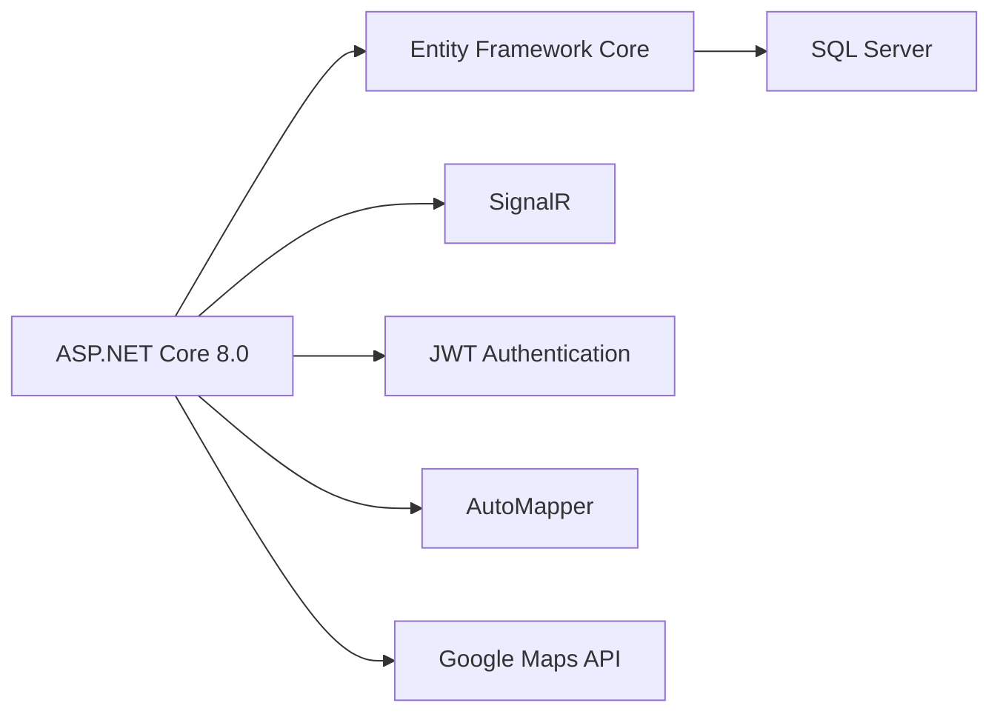
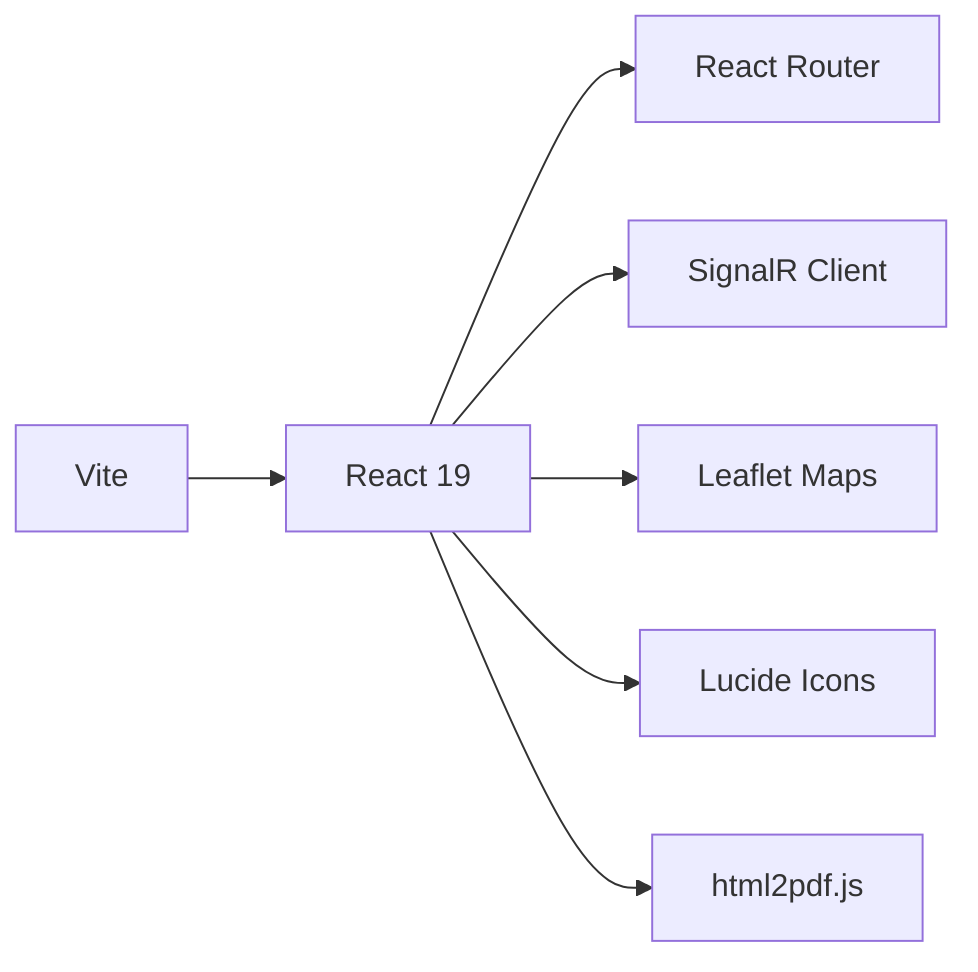
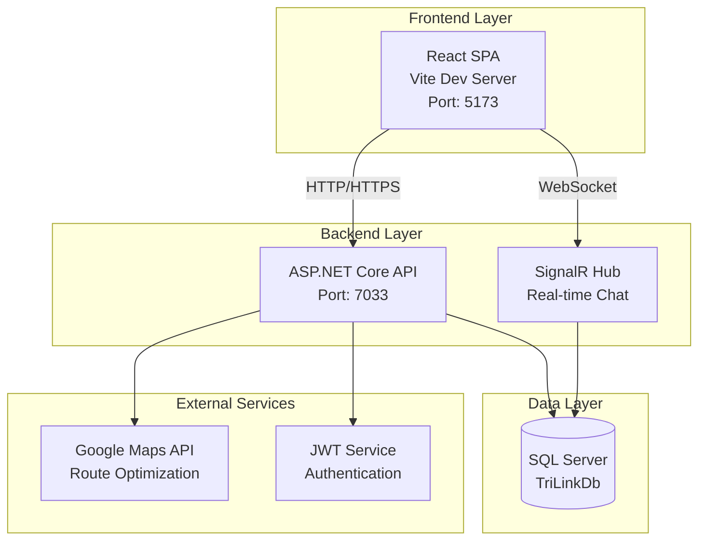
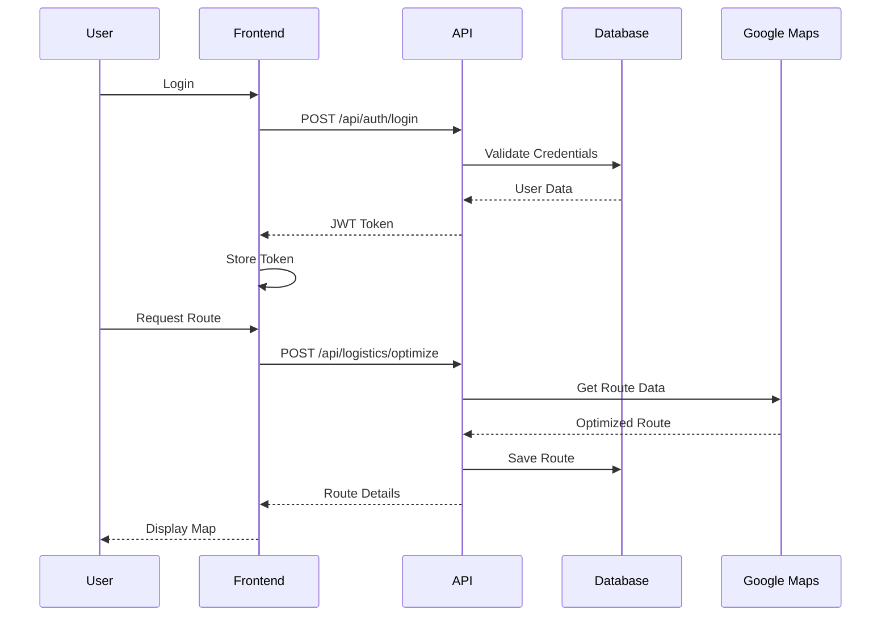

# TriLink - Smart Logistics and Supply Chain Management Platform

> A comprehensive B2B platform connecting buyers, suppliers, and logistics providers with AI-powered route optimization and real-time negotiation features.

## 📹 Project Demo Video

*[Video will be added here - Project navigation and features walkthrough]*

---

## 📋 Table of Contents

- [About the Project](#about-the-project)
- [Key Features](#key-features)
- [Technology Stack](#technology-stack)
- [System Architecture](#system-architecture)
- [Project Structure](#project-structure)
- [Prerequisites](#prerequisites)
- [Installation Guide](#installation-guide)
- [Configuration](#configuration)
- [Running the Application](#running-the-application)
- [API Documentation](#api-documentation)
- [Troubleshooting](#troubleshooting)
- [Contributing](#contributing)

---

## 🎯 About the Project

**TriLink** is a modern supply chain management platform that streamlines the entire B2B transaction lifecycle. It connects three key stakeholders:

- **🛒 Buyers**: Browse products, negotiate prices, place orders, and track deliveries
- **🏭 Suppliers**: Manage inventory, handle negotiations, fulfill orders, and generate invoices
- **🚚 Logistics Providers**: Optimize routes, manage deliveries, and track shipments

The platform leverages AI for intelligent route planning, real-time chat for negotiations, and comprehensive dashboard analytics for business insights.

---

## ✨ Key Features

### 🔐 Authentication & Authorization
- JWT-based secure authentication
- Role-based access control (Buyer, Supplier, Logistics)
- Secure password hashing with BCrypt

### 💬 Real-time Communication
- SignalR-powered chat system
- Live negotiation threads
- Instant offers and counter-offers

### 🤖 AI-Powered Logistics
- Google Maps integration for route planning
- AI-optimized route suggestions
- Multi-location delivery optimization
- Real-time cost estimation

### 📊 Advanced Dashboard
- Role-specific analytics
- Order tracking and management
- Invoice generation and PDF export
- Performance metrics and insights

### 🔄 Complete Business Workflow
- Product catalog management
- Price negotiation system
- Order processing pipeline
- Logistics job assignment
- Invoice generation

---

## 🛠 Technology Stack

### Backend (.NET 8.0)


**Technologies:**
- **Framework**: ASP.NET Core 8.0 Web API
- **ORM**: Entity Framework Core 8.0
- **Database**: Microsoft SQL Server
- **Authentication**: JWT Bearer Tokens
- **Real-time Communication**: SignalR
- **Password Hashing**: BCrypt.Net
- **Object Mapping**: AutoMapper
- **API Documentation**: Swagger/OpenAPI

### Frontend (React + Vite)


**Technologies:**
- **Library**: React 19.2
- **Build Tool**: Vite 5.4
- **Routing**: React Router DOM 7.9
- **Real-time**: @microsoft/signalr
- **Maps**: React Leaflet + Leaflet
- **Icons**: Lucide React
- **PDF Export**: html2pdf.js

---

## 🏗 System Architecture



### Request Flow



---

## 📁 Project Structure

```
TriLink/
│
├── backend/                          # .NET Backend
│   ├── Controllers/                  # API Endpoints
│   │   ├── AuthController.cs        # Authentication
│   │   ├── ProductController.cs     # Product Management
│   │   ├── NegotiationController.cs # Negotiation System
│   │   ├── OrderController.cs       # Order Processing
│   │   ├── LogisticsController.cs   # Route Planning
│   │   ├── InvoiceController.cs     # Invoice Generation
│   │   ├── ChatController.cs        # Chat History
│   │   └── ...
│   │
│   ├── Models/                       # Data Models
│   │   ├── User.cs
│   │   ├── Product.cs
│   │   ├── Order.cs
│   │   ├── Negotiation.cs
│   │   └── ...
│   │
│   ├── Repositories/                 # Data Access Layer
│   │   ├── IUserRepository.cs
│   │   ├── UserRepository.cs
│   │   └── ...
│   │
│   ├── Services/                     # Business Logic
│   │   ├── GoogleMapsService.cs     # Maps Integration
│   │   ├── AIService.cs             # AI Route Optimization
│   │   ├── RouteService.cs          # Route Management
│   │   └── TransportCostService.cs  # Cost Calculation
│   │
│   ├── Hubs/                         # SignalR Hubs
│   │   └── ChatHub.cs               # Real-time Chat
│   │
│   ├── Data/                         # Database Context
│   │   └── TriLinkDbContext.cs
│   │
│   ├── Migrations/                   # EF Core Migrations
│   │
│   ├── Mappings/                     # AutoMapper Profiles
│   │   └── AutoMapperProfile.cs
│   │
│   ├── .env                          # Environment Variables (SECRET)
│   ├── .env.example                  # Environment Template
│   ├── appsettings.json             # App Configuration
│   ├── Program.cs                    # Entry Point
│   └── Backend.csproj               # Project File
│
├── frontend/                         # React Frontend
│   ├── src/
│   │   ├── pages/                   # Page Components
│   │   │   ├── DashboardPage.jsx
│   │   │   ├── ProductsPage.jsx
│   │   │   ├── NegotiationPage.jsx
│   │   │   ├── OrdersPage.jsx
│   │   │   ├── LogisticsPage.jsx
│   │   │   ├── ChatPage.jsx
│   │   │   └── ...
│   │   │
│   │   ├── components/              # Reusable Components
│   │   │   └── Navbar/
│   │   │
│   │   ├── api/                     # API Service
│   │   │   └── apiService.js
│   │   │
│   │   ├── App.jsx                  # Main App Component
│   │   ├── main.jsx                 # Entry Point
│   │   └── index.css                # Global Styles
│   │
│   ├── public/                       # Static Assets
│   ├── package.json                  # Dependencies
│   ├── vite.config.js               # Vite Configuration
│   └── index.html                   # HTML Template
│
├── run.bat                           # Quick Start Script
├── stop.bat                          # Stop All Services
├── .gitignore                        # Git Ignore Rules
└── README.md                         # This File
```

---

## 📦 Prerequisites

Before you begin, ensure you have the following installed on your machine:

### 1. **.NET 8.0 SDK**
> Required for running the backend API

- **Download**: [https://dotnet.microsoft.com/download/dotnet/8.0](https://dotnet.microsoft.com/download/dotnet/8.0)
- **Version**: 8.0 or higher
- **Verify Installation**:
  ```cmd
  dotnet --version
  ```
  Expected output: `8.0.x`

### 2. **Node.js & npm**
> Required for running the frontend

- **Download**: [https://nodejs.org/](https://nodejs.org/) (LTS version recommended)
- **Version**: Node.js 18.x or higher
- **Verify Installation**:
  ```cmd
  node --version
  npm --version
  ```
  Expected output: `v18.x.x` and `10.x.x`

### 3. **Microsoft SQL Server**
> Required for database

**Option A: SQL Server Express (Free)**
- **Download**: [https://www.microsoft.com/sql-server/sql-server-downloads](https://www.microsoft.com/sql-server/sql-server-downloads)
- Choose "Express" edition

**Option B: SQL Server Developer Edition (Free, Full-featured)**
- **Download**: Same link as above
- Choose "Developer" edition

**SQL Server Management Studio (SSMS) - Optional but Recommended**
- **Download**: [https://docs.microsoft.com/sql/ssms/download-sql-server-management-studio-ssms](https://docs.microsoft.com/sql/ssms/download-sql-server-management-studio-ssms)
- Useful for database management

### 4. **Git (Optional)**
> For version control

- **Download**: [https://git-scm.com/downloads](https://git-scm.com/downloads)

### 5. **Code Editor (Recommended)**

**Visual Studio Code**
- **Download**: [https://code.visualstudio.com/](https://code.visualstudio.com/)
- Lightweight and great for both frontend and backend

**OR**

**Visual Studio 2022 (For .NET Development)**
- **Download**: [https://visualstudio.microsoft.com/downloads/](https://visualstudio.microsoft.com/downloads/)
- Community edition is free

---

## 🚀 Installation Guide

### Step 1: Clone or Download the Project

**Option A: Using Git**
```cmd
git clone <your-repository-url>
cd TriLink
```

**Option B: Download ZIP**
1. Download the project as a ZIP file
2. Extract to desired location
3. Open Command Prompt and navigate to the extracted folder

### Step 2: Install Backend Dependencies

```cmd
cd backend
dotnet restore
```

This command will download and install all required NuGet packages:
- Entity Framework Core
- JWT Authentication
- AutoMapper
- BCrypt
- SignalR
- Swagger
- DotNetEnv

### Step 3: Install Frontend Dependencies

```cmd
cd ..\frontend
npm install
```

This will install all required npm packages:
- React and React DOM
- React Router
- SignalR Client
- Leaflet (Maps)
- Lucide Icons
- html2pdf.js
- Vite

---

## ⚙️ Configuration

### 1. Database Setup

#### Option A: Using the Default Connection String

The project is configured for SQL Server with instance name `MSSQLSERVER01`. If your SQL Server instance has a different name:

**Find your SQL Server instance name:**
1. Open SQL Server Management Studio (SSMS)
2. When connecting, the "Server name" shows your instance
3. Common names: `localhost`, `.\SQLEXPRESS`, `localhost\MSSQLSERVER01`

#### Option B: Update Connection String

Edit `backend\appsettings.json` and update the ConnectionStrings section:
```json
"ConnectionStrings": {
  "TriLinkConnectionString": "Server=YOUR_SERVER_NAME;Database=TriLinkDb;Trusted_Connection=True;TrustServerCertificate=True"
}
```

### 2. Environment Variables Setup

**Step 1:** Navigate to backend folder
```cmd
cd backend
```

**Step 2:** Copy the example file
```cmd
copy .env.example .env
```

**Step 3:** Edit `.env` file with your actual values

Open `backend\.env` in a text editor and update:

```env
# Google Maps API Key - Get from: https://console.cloud.google.com/
GoogleMaps__ApiKey=YOUR_GOOGLE_MAPS_API_KEY_HERE

# JWT Secret Key - Generate a strong random string (minimum 32 characters)
Jwt__Key=YOUR_STRONG_SECRET_KEY_HERE_MINIMUM_32_CHARACTERS
```

**Note:** The database connection string is configured in `backend\appsettings.json`. Only Google Maps API key and JWT secret need to be in `.env` for security.

#### 🗺️ Getting Google Maps API Key

1. Go to [Google Cloud Console](https://console.cloud.google.com/)
2. Create a new project or select existing
3. Enable these APIs:
   - Google Maps JavaScript API
   - Directions API
   - Geocoding API
4. Go to "Credentials" → "Create Credentials" → "API Key"
5. Copy the API key and paste in `.env` file

#### 🔑 Generating JWT Secret Key

Use a strong random string (minimum 32 characters). You can generate one using:

**PowerShell:**
```powershell
-join ((65..90) + (97..122) + (48..57) | Get-Random -Count 32 | % {[char]$_})
```

**Online Generator:**
- [https://randomkeygen.com/](https://randomkeygen.com/) (Use "Fort Knox Passwords")

### 3. Database Migration

Create and seed the database:

```cmd
cd backend
dotnet ef database update
```

This will:
- Create the `TriLinkDb` database
- Create all necessary tables
- Apply all migrations

**If you get "dotnet ef not found" error:**
```cmd
dotnet tool install --global dotnet-ef
```

---

## ▶️ Running the Application

### Option 1: One-Click Start (Recommended) ⚡

Simply double-click `run.bat` in the root folder, or run:

```cmd
run.bat
```

This will:
1. Check if `.env` exists
2. Start the backend in one terminal
3. Start the frontend in another terminal
4. Show you the access URLs

### Option 2: Manual Start

**Terminal 1 - Backend:**
```cmd
cd backend
dotnet run
```

Wait for:
```
Now listening on: https://localhost:7033
```

**Terminal 2 - Frontend:**
```cmd
cd frontend
npm run dev
```

Wait for:
```
Local: http://localhost:5173
```

### Stopping the Application

**Option 1:** Double-click `stop.bat`

**Option 2:** Press `Ctrl + C` in each terminal window

---

## 🌐 Access URLs

Once running, access the application at:

| Service | URL | Description |
|---------|-----|-------------|
| **Frontend** | [http://localhost:5173](http://localhost:5173) | React Application |
| **Backend API** | [https://localhost:7033](https://localhost:7033) | REST API |
| **Swagger Docs** | [https://localhost:7033/swagger](https://localhost:7033/swagger) | API Documentation |
| **SignalR Hub** | `https://localhost:7033/chathub` | Real-time Chat |

---

## 📚 API Documentation

When the backend is running, visit Swagger UI for complete API documentation:

**URL**: [https://localhost:7033/swagger](https://localhost:7033/swagger)

### Main API Endpoints

#### Authentication
```http
POST /api/auth/register          # Register new user
POST /api/auth/login             # Login user
```

#### Products
```http
GET    /api/product              # Get all products
GET    /api/product/{id}         # Get product by ID
POST   /api/product              # Create product (Supplier)
PUT    /api/product/{id}         # Update product (Supplier)
DELETE /api/product/{id}         # Delete product (Supplier)
```

#### Negotiations
```http
GET  /api/negotiation/buyer      # Get buyer negotiations
GET  /api/negotiation/supplier   # Get supplier negotiations
POST /api/negotiation            # Start new negotiation
POST /api/negotiation/offer      # Submit counter offer
```

#### Orders
```http
GET  /api/order/buyer            # Get buyer orders
GET  /api/order/supplier         # Get supplier orders
POST /api/order                  # Create order
PUT  /api/order/status           # Update order status
```

#### Logistics
```http
GET  /api/logistics/jobs         # Get logistics jobs
POST /api/logistics/optimize     # AI route optimization
POST /api/logistics/manual       # Manual route creation
```

#### Invoices
```http
GET  /api/invoice/{orderId}      # Get invoice by order
POST /api/invoice/generate       # Generate invoice
```

---

## 🎨 Default User Roles

The system supports three user roles:

| Role | Description | Access |
|------|-------------|--------|
| **Buyer** | Purchase products | Browse, Negotiate, Order, Track |
| **Supplier** | Sell products | Manage Products, Orders, Invoices |
| **Logistics** | Handle deliveries | Route Planning, Job Management |

---

## 🔧 Troubleshooting

### Issue: Port Already in Use

**Error**: `Address already in use` or `Port 5173/7033 is already in use`

**Solution**:
1. Run `stop.bat` to close existing instances
2. Or manually find and kill the process:
   ```cmd
   netstat -ano | findstr :5173
   taskkill /PID <PID> /F
   ```

### Issue: Database Connection Failed

**Error**: `Cannot connect to SQL Server`

**Solutions**:
1. Verify SQL Server is running:
   - Open "Services" (Win + R → `services.msc`)
   - Find "SQL Server (MSSQLSERVER)" or your instance name
   - Ensure it's "Running"

2. Check connection string in `backend\.env`
   - Verify server name matches your SQL Server instance

3. Enable TCP/IP:
   - Open "SQL Server Configuration Manager"
   - SQL Server Network Configuration → Protocols
   - Enable "TCP/IP"

### Issue: .env File Not Found

**Error**: `WARNING: backend\.env file not found!`

**Solution**:
```cmd
cd backend
copy .env.example .env
```
Then edit `.env` with your API keys

### Issue: Google Maps Not Working

**Symptoms**: Routes not displaying, map errors

**Solutions**:
1. Verify API key in `backend\.env`
2. Ensure these APIs are enabled in Google Cloud Console:
   - Maps JavaScript API
   - Directions API
   - Geocoding API
3. Check API key restrictions (should allow your localhost)

### Issue: SignalR Connection Failed

**Error**: Chat not working, real-time updates failing

**Solutions**:
1. Ensure backend is running on port 7033
2. Check CORS settings in `backend\Program.cs`
3. Verify browser console for errors (F12)

### Issue: Migration Errors

**Error**: `The database is not in a valid state`

**Solution**: Reset database
```cmd
cd backend
dotnet ef database drop
dotnet ef database update
```

### Issue: npm Install Fails

**Error**: Package installation errors

**Solutions**:
1. Clear npm cache:
   ```cmd
   npm cache clean --force
   ```

2. Delete `node_modules` and try again:
   ```cmd
   cd frontend
   rmdir /s /q node_modules
   del package-lock.json
   npm install
   ```

3. Update npm:
   ```cmd
   npm install -g npm@latest
   ```

### Issue: HTTPS Certificate Errors

**Error**: SSL/TLS certificate warnings

**Solution**: Trust development certificate
```cmd
dotnet dev-certs https --trust
```

---

## 📝 Additional Commands

### Backend Commands

```cmd
# Restore packages
dotnet restore

# Build project
dotnet build

# Run project
dotnet run

# Create new migration
dotnet ef migrations add MigrationName

# Update database
dotnet ef database update

# Drop database
dotnet ef database drop
```

### Frontend Commands

```cmd
# Install dependencies
npm install

# Run development server
npm run dev

# Build for production
npm run build

# Preview production build
npm run preview

# Run linter
npm run lint
```

---

## 🔒 Security Notes

- ✅ Never commit `.env` file (it's in `.gitignore`)
- ✅ Use strong JWT secret keys (minimum 32 characters)
- ✅ Keep API keys confidential
- ✅ Use HTTPS in production
- ✅ Regularly update dependencies

---

## 🤝 Contributing

1. Create a feature branch
2. Make your changes
3. Test thoroughly
4. Submit a pull request

---

## 📄 License

[Add your license information here]

---

## 👥 Team

1. Balaji U
2. Parthiban
3. Mohanraj
4. Udhay M

---

## 📞 Support

For issues or questions:
- Create an issue in the repository
- [Add contact information]

---

## 🎉 Acknowledgments

- Google Maps API for route optimization
- Microsoft for .NET and SignalR
- React team for the amazing framework
- All open-source contributors

---

**Happy Coding! 🚀**
