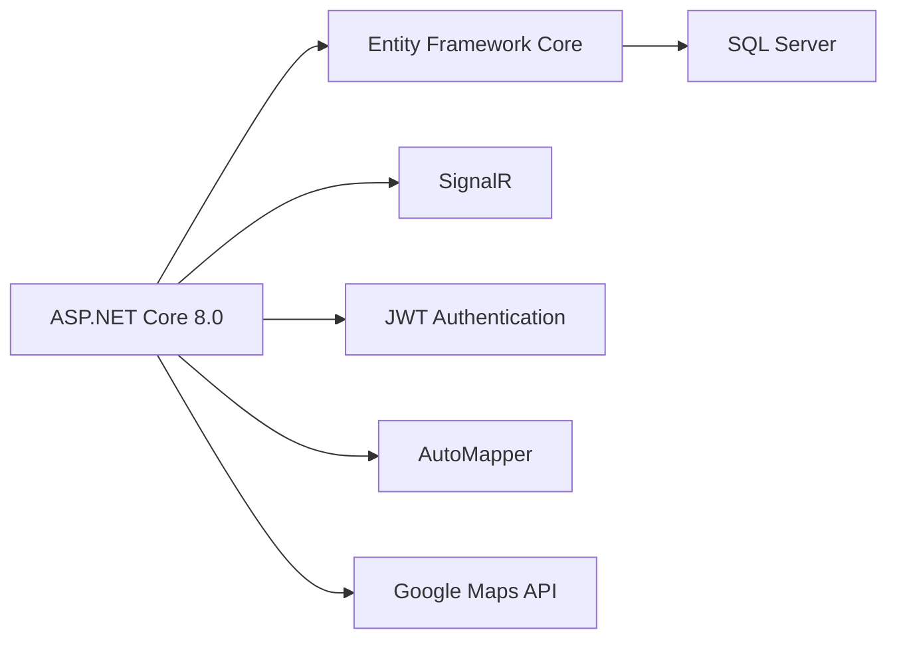
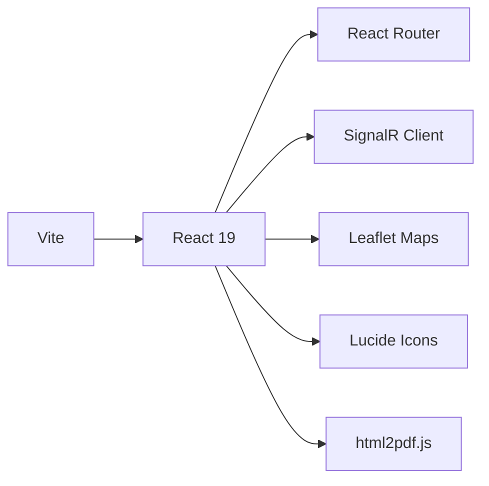
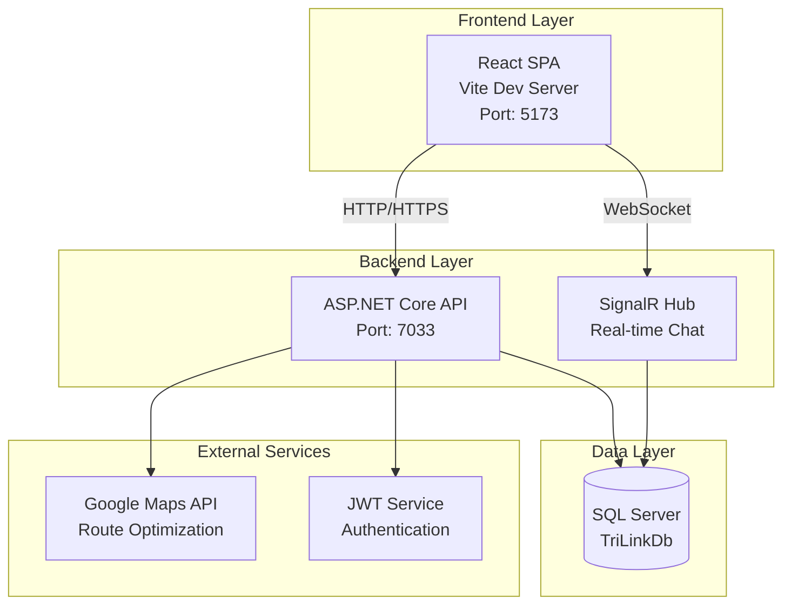
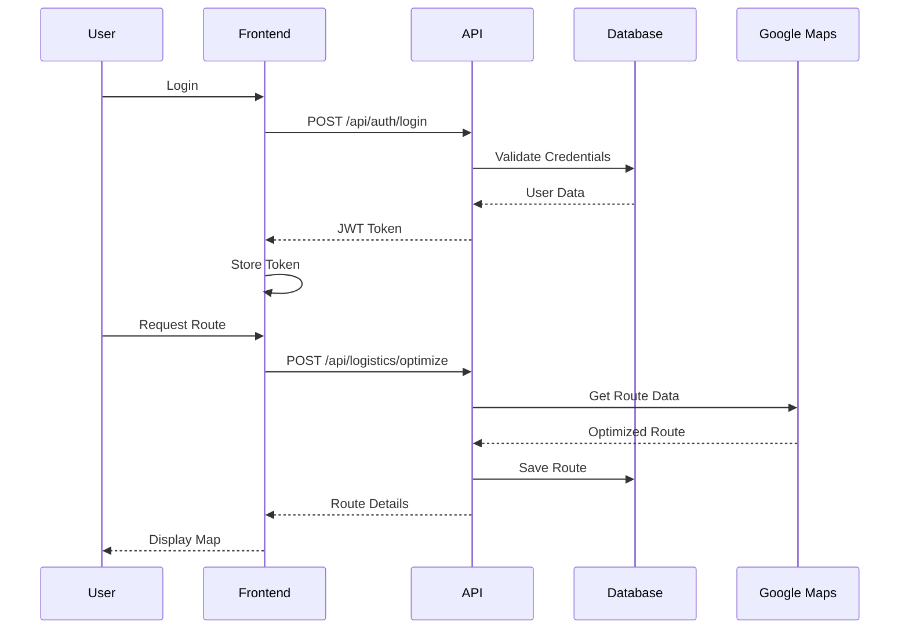

# TriLink - Smart Logistics and Supply Chain Management Platform

> A comprehensive B2B platform connecting buyers, suppliers, and logistics providers with AI-powered route optimization and real-time negotiation features.

## 📋 Table of Contents

- [About the Project](#about-the-project)
- [Key Features](#key-features)
- [Technology Stack](#technology-stack)
- [System Architecture](#system-architecture)
---

## 🎯 About the Project

**TriLink** is a modern supply chain management platform that streamlines the entire B2B transaction lifecycle. It connects three key stakeholders:

- **🛒 Buyers**: Browse products, negotiate prices, place orders, and track deliveries
- **🏭 Suppliers**: Manage inventory, handle negotiations, fulfill orders, and generate invoices
- **🚚 Logistics Providers**: Optimize routes, manage deliveries, and track shipments

The platform leverages AI for intelligent route planning, real-time chat for negotiations, and comprehensive dashboard analytics for business insights.

---

## ✨ Key Features

### 🔐 Authentication & Authorization
- JWT-based secure authentication
- Role-based access control (Buyer, Supplier, Logistics)
- Secure password hashing with BCrypt

### 💬 Real-time Communication
- SignalR-powered chat system
- Live negotiation threads
- Instant offers and counter-offers

### 🤖 AI-Powered Logistics
- Google Maps integration for route planning
- AI-optimized route suggestions
- Multi-location delivery optimization
- Real-time cost estimation

### 📊 Advanced Dashboard
- Role-specific analytics
- Order tracking and management
- Invoice generation and PDF export
- Performance metrics and insights

### 🔄 Complete Business Workflow
- Product catalog management
- Price negotiation system
- Order processing pipeline
- Logistics job assignment
- Invoice generation

---

## 🛠 Technology Stack

### Backend (.NET 8.0)

**Technologies:**
- **Framework**: ASP.NET Core 8.0 Web API
- **ORM**: Entity Framework Core 8.0
- **Database**: Microsoft SQL Server
- **Authentication**: JWT Bearer Tokens
- **Real-time Communication**: SignalR
- **Password Hashing**: BCrypt.Net
- **Object Mapping**: AutoMapper
- **API Documentation**: Swagger/OpenAPI

### Frontend (React + Vite)

**Technologies:**
- **Library**: React 19.2
- **Build Tool**: Vite 5.4
- **Routing**: React Router DOM 7.9
- **Real-time**: @microsoft/signalr
- **Maps**: React Leaflet + Leaflet
- **Icons**: Lucide React
- **PDF Export**: html2pdf.js

---

## 🏗 System Architecture

### Request Flow

## 👥 Team

1. Balaji U
2. Parthiban
3. Mohanraj
4. Udhay M

---

---

**Happy Coding! 🚀**
